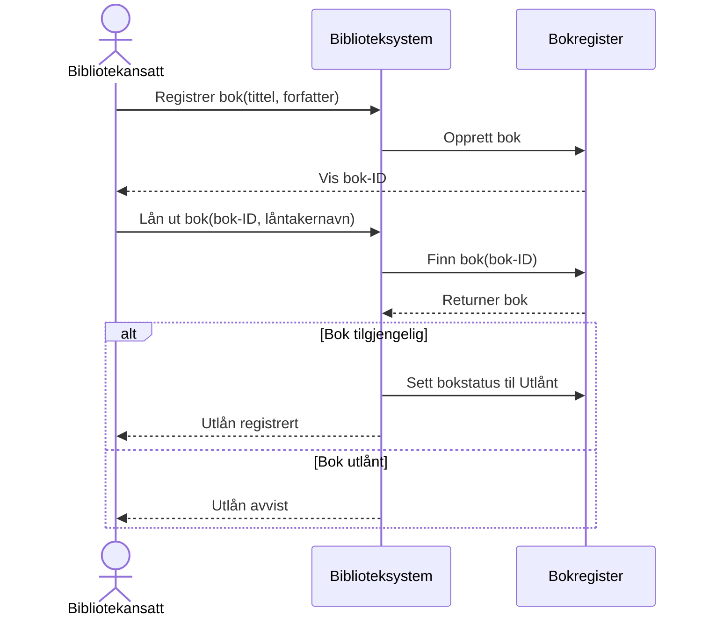

# Biblioteksystem 📚

## REST API

```
POST /books
Request: {"title":"","author":""}
Response:
 - Status 201 Created
 - Returns uuid string
```

```
GET /books/{id}
Response:
 - Status 201 Created
 - Returns {"title":"","author":"","available":true}
```

```
POST /loans
Request: {"bookId":"","patron":"","expiryDate":""}
Response:
 - Status 201 Created
 - Returns uuid string
```

```
DELETE /loans/{id}
Response:
 - Status 200 Ok
 - Returns {"patron":"","late":true}
```

## Sekvensdiagram (MVP)


