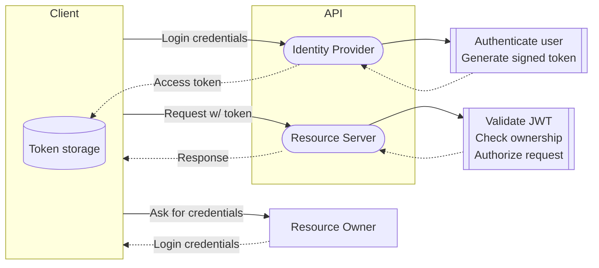
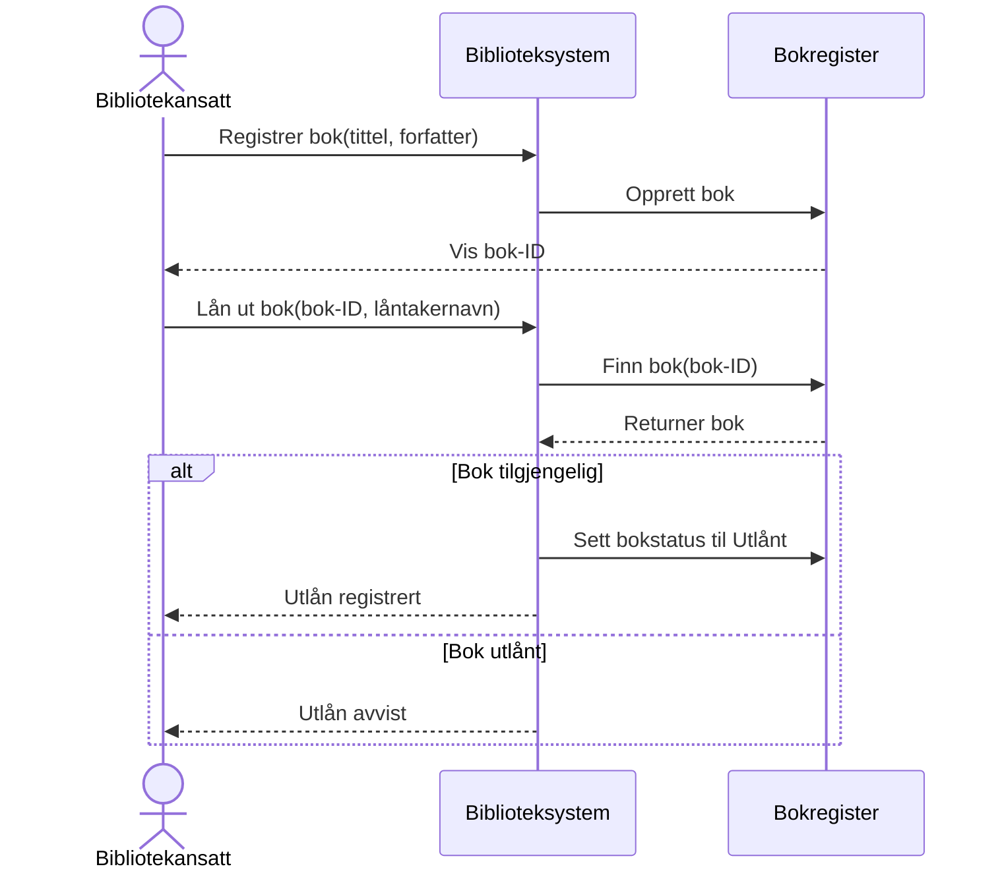

# Biblioteksystem 📚

## User Authentication

### Rules

- Librarian (admin) users create and remove loans.
- A loan is associated with a user and is visible to them.
- User A must not be able to see User B's loans.

### Authentication Diagram


```mermaid
flowchart LR
	subgraph CLIENT["Client"]
	   Cache[("Token storage")]
	end
	subgraph API
		IdP(["Identity Provider"])
		RSrv(["Resource Server"])
	end
	User["Resource Owner"]

	Login[[
		Authenticate user
		Generate signed token
	]]
	Access[[
		Validate JWT
		Check ownership
		Authorize request
	]]

	CLIENT --"Ask for credentials"--> User
	User -."Login credentials".-> CLIENT
	CLIENT --"Login credentials"--> IdP
	IdP -."Access token".-> Cache
	CLIENT --"Request w/ token"--> RSrv

	IdP --> Login .-> IdP
	RSrv --> Access .-> RSrv

	RSrv -."Response".-> CLIENT
```

## Running the project

From the project directory, run:

```bash
docker compose up
```

or to run the unit tests, run:

```bash
dotnet test
```

## REST API

```
POST /books
Request: {"title":"","author":""}
Response:
 - Status 201 Created
 - Returns uuid string
```

```
GET /books/{id}
Response:
 - Status 201 Created
 - Returns {"title":"","author":"","available":true}
```

```
POST /loans
Request: {"bookId":"","patron":"","expiryDate":""}
Response:
 - Status 201 Created
 - Returns uuid string
```

```
DELETE /loans/{id}
Response:
 - Status 200 Ok
 - Returns {"patron":"","late":true}
```

## Sekvensdiagram (MVP)


```mermaid
sequenceDiagram
    actor Ansatt as Bibliotekansatt
    participant System as Biblioteksystem
    participant BokRegister as Bokregister

    Ansatt->>System: Registrer bok(tittel, forfatter)
    System->>BokRegister: Opprett bok
    BokRegister-->>Ansatt: Vis bok-ID

    Ansatt->>System: Lån ut bok(bok-ID, låntakernavn)
    System->>BokRegister: Finn bok(bok-ID)
    BokRegister-->>System: Returner bok

    alt Bok tilgjengelig
        System->>BokRegister: Sett bokstatus til Utlånt
        System-->>Ansatt: Utlån registrert
    else Bok utlånt
        System-->>Ansatt: Utlån avvist
    end
```
